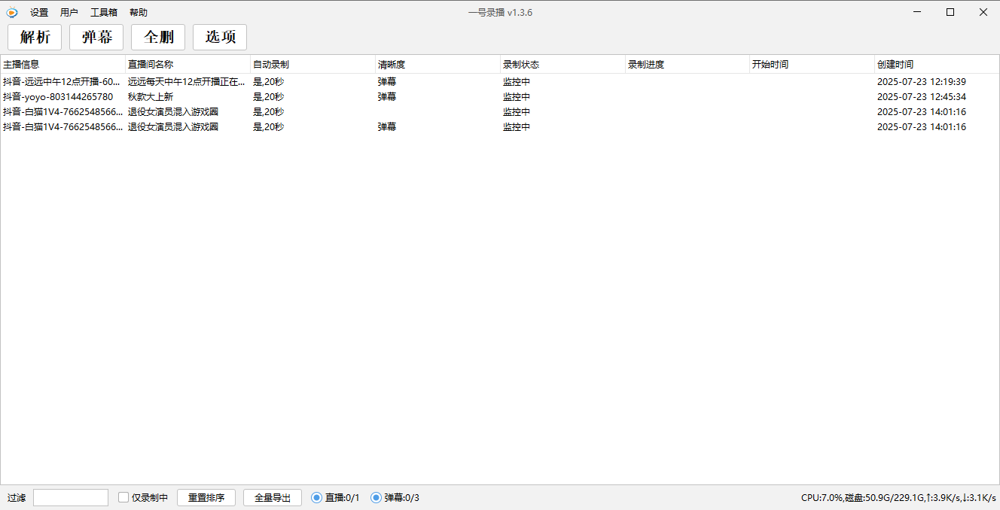
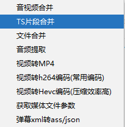

# onerecord

#### 介绍
一号录播，一款支持国内外主流直播平台的直播录制录屏工具。官网：https://bestlive.cc/


#### 安装教程

官网下载安装即可：地址：https://bestlive.cc/

支持mac，windows平台，支持docker版本，支持在nas安装。

docker版本安装：

```
docker run -d --restart always --name onerecord \
-v /data/onerecord/config:/data/feiyu-live-server/config \
-v /data/onerecord/config/oneRecord:/root/.OneRecord \
-v /data/onerecord/logs:/root/.feiyu/logs \
-v /data/onerecord/config/aliyunpan:/data/feiyu-live-server/ali \
-v /data/onerecord/config/bypy:/root/.bypy \
-v /data/onerecord/data:/data/feiyu-live-server/data \
-p 18080:8080 \
-e "JVMPARAM=-Xms512m -Xmx1g" \
-e "ACTIVEPROFILES=pro" \
onerecord:latest
```

使用国内的镜像：

```
docker run -d --restart always --name onerecord \
-v /data/onerecord/config:/data/feiyu-live-server/config \
-v /data/onerecord/config/oneRecord:/root/.OneRecord \
-v /data/onerecord/logs:/root/.feiyu/logs \
-v /data/onerecord/config/aliyunpan:/data/feiyu-live-server/ali \
-v /data/onerecord/config/bypy:/root/.bypy \
-v /data/onerecord/data:/data/feiyu-live-server/data \
-p 18080:8080 \
-e "JVMPARAM=-Xms512m -Xmx1g" \
-e "ACTIVEPROFILES=pro" \
registry.cn-hangzhou.aliyuncs.com/onerecord/onerecord:latest
```


### 支持功能
 * 支持抖音、快手、b站、虎牙、小红书、soop live、tiktok等超过50个国内外主流直播平台直播录制
 * 支持部分主流网站的弹幕录制
 * 支持自动录制、多种通知方式、按时间分段
 * 提供强相关的工具箱
 * 支持直播嗅探，可以嗅探视频号直播，小程序内的直播

#### 使用说明

1.  下载安装
2.  使用解析功能，将直播链接填充进去url输入框
3.  回车等待皆可

### 软件截图



## 问题及功能反馈

请提issue
